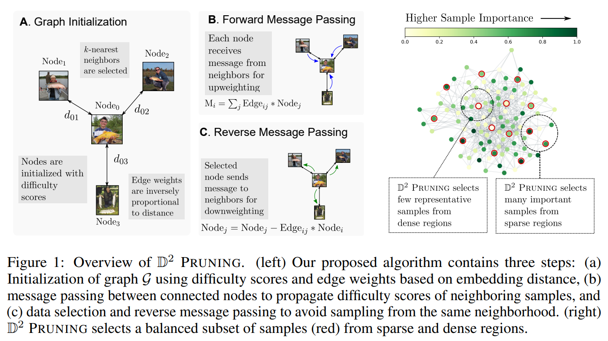

## D2 Pruning: Message Passing for Balancing Diversity & Difficulty in Data Pruning
* Authors: [Adyasha Maharana](https://adymaharana.github.io/), [Prateek Yadav](https://prateek-yadav.github.io/), and [Mohit Bansal](https://www.cs.unc.edu/~mbansal/)
* Paper: [arXiv]()



### Setup

1. Create a virtual environment and activate it.
```
python3 -m venv env
source env/bin/activate
```
2. Install dependencies for all datasets except DataComp
```
python -m pip install -r requirements.txt -f https://download.pytorch.org/whl/cu113/torch_stable.html
```
For DataComp, see requirements of the [DataComp](https://github.com/mlfoundations/datacomp) codebase and additionally install [faiss](https://github.com/facebookresearch/faiss/blob/main/INSTALL.md).

### Training ResNet18 models on CIFAR10, CIFAR100
The following commands are usage examples. See our paper for the hyperparameters of each dataset.
```
# Train model on full dataset to extract training dynamics
python train.py --dataset cifar10 --gpuid 0 --epochs 200 --lr 0.1 --network resnet18 --batch-size 256 --task-name all-data --base-dir ./data-model/cifar10

# Get importance scores and sample embeddings
python generate_importance_score.py --gpuid 0 --base-dir ./data-model/cifar10 --task-name all-data --feature

# Select samples using D2 pruning and train ResNet 18 on the selected coreset
N_NEIGHBOR=5
GAMMA=0.1
CORESET_RATIO=0.1
python train.py --dataset cifar10 --gpuid 1 --iterations 40000 --task-name class-lb-graph-n=$N_NEIGHBOR-g=$GAMMA-$CORESET_RATIO \
    --base-dir ./data-model/cifar10/class/ --coreset --coreset-mode class --budget-mode uniform --sampling-mode graph \
    --data-score-path ./data-model/cifar10/all-data/data-score-all-data.pickle \
    --feature-path ./data-model/cifar10/all-data/train-features-all-data.npy \
    --coreset-key forgetting --coreset-ratio $CORESET_RATIO --mis-ratio 0.4 --label-balanced \
    --n-neighbor $N_NEIGHBOR --gamma $GAMMA --stratas 25 --graph-mode sum --graph-sampling-mode weighted
```


### Training ResNet models on ImageNet-1K \[coming soon\]


### Training RoBERTa models on Adversarial NLI, ImDB-1k \[coming soon\]


### Training CLIP-style model on DataComp
Follow instructions [here](https://github.com/mlfoundations/datacomp) to first download the DataComp \[small\] dataset.
```
# Select samples using D2 pruning from the DataComp dataset
N_NEIGHBOR=1
GAMMA=1.0
FRACTION=0.3
python select_d2_datacomp.py \
    --metadata-dir ./datacomp/metadata/ --out-dir ./datacomp/d2/  \
    --n-neighbors $N_NEIGHBOR --gamma $GAMMA --fraction $FRACTION \
    --feature-type image|text
```
This script generates a numpy file containing the UIDs of the DataComp subset that can then be used to reshard the DataComp data for training.

### Acknowledgements
Thanks to the authors of [Coverage-centric Coreset Selection for High Pruning Rates](https://github.com/haizhongzheng/Coverage-centric-coreset-selection) for releasing their code for evaluating CCS and training ResNet models on CIFAR10, CIFAR100, ImageNet-1K. Much of this codebase has been adapted from their code. Also, thanks to the authors of [Beyond neural scaling laws: beating power law scaling via data pruning](https://github.com/rgeirhos/dataset-pruning-metrics) for releasing the protoypicality scores on ImageNet-1K.

### Reference
Please cite our paper if you use the $D^2$ pruning method in your works:
```bibtex

@article{maharana2023d2pruning,
  title         = {D2 Pruning: Message Passing for Balancing Diversity & Difficulty in Data Pruning},
  author        = {Adyasha Maharana and Prateek Yadav and Mohit Bansal},
  year          = {2023},
  archivePrefix = {arXiv},
  primaryClass  = {cs.ML},
  eprint        = {}
}
```